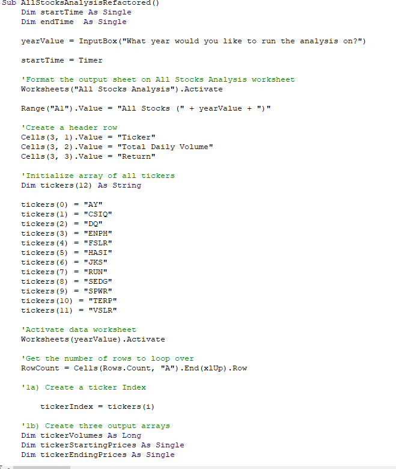

# Stock_Analysis
VBA Stock analysis project Module 2

# Overview of Project
An analysis of the performance of a variety of stocks was performed at the request of client, Steve. After an original analysis of a pre-selected list of stocks, Steve also requested an updated code that would be able to run efficiently over data from the stock market at large. In order to meet this request, the original analysis code was refactored to reduce run time.

# Results 
You'll note that in the screenshots below, the run-time has drastically increased. It turns out that this is because it's running on almost no data, and the analyst failed to clear the screen. When re-run with a clear screen, it simply performs an analysis on the same stock 12 times, showing the results 12 times as well. While I was unable to troubleshoot this portion (which is really a significant portion of the assignment), I decided to upload and submit showing the refactored code in the hopes that I'll be able to get a hold of a tutor and tweak my code to show the correct results. 

# Screenshots of where I've gone wrong
Screenshots of my unsuccessful attempts (which I plan to redo and re-upload) are as follows:

# Summary 
## Advantages and disadvantages of refactoring code
In general, refactoring code can have a variety of advantages and disadvantages. If you did not write the original code, or if you simply did not comment out the original code in enough detail to prompt your memory, it's possible that while refactoring you may miss important sections and end up creating more problems than solutions.
## Application of these pros and cons to refactoring this particular code
In this particular instance, the pro of refactoring the code is obvious- using it's original iteration with the newly expanded dataset will cause an exponential increase in the run time and resources used. This generally reflects more on the practice of simplifying code and removing repetitions whenever possible than it does on the overall uses of refactoring as a process.
In this particular code, the con of refactoring the code was fairly specific to me as a user- since I was unable to get the refactored code to work correctly, I've helped nothing!
